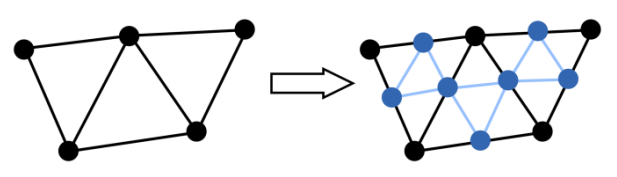
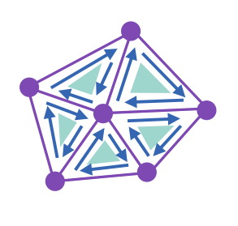
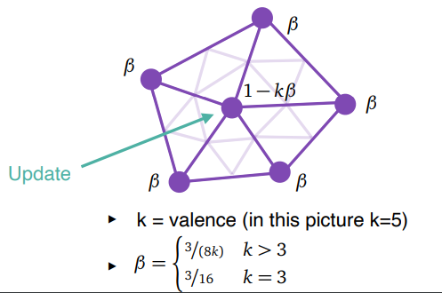
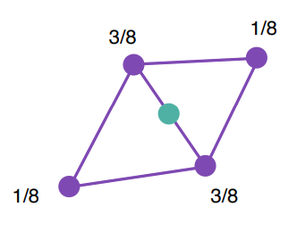
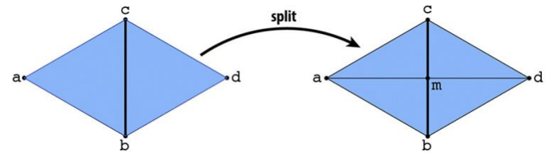
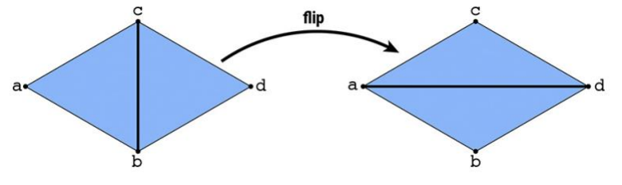
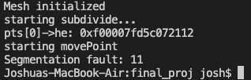
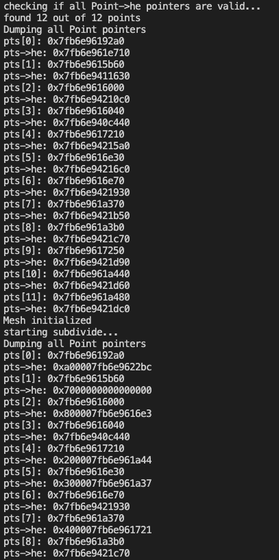

# Loop Subdivision

In this project, I created a program that should be able to parse a .obj file that describes a triangle mesh into a Halfedge mesh. Then, the program is able to subdivide the triangles in the mesh such that the surfaces appear smoother with each iteration of the subdivision algorithm. The subdivision algorithm has the following steps:
1. Update the position of all vertices based on it's surrounding vertices.
2. Create a new vertex, who's position is also based on surrounding vertices for every edge in the mesh
3. Connect each new vertex with a new edge, turning each triangle in the mesh into 4 subtriangles

## Halfedge Mesh

In order to implement the above algorithm, we need a convienient way to traverse the topology of the triangle mesh. Traditionally, the triangle mesh is described by one-dimensional vertex and connectivity buffers. The vertex buffer stores the geometric position of all vertices in the mesh, and the connectivity buffer stores the indices of the vertices that are connected as a triangle in sets of 3. The Halfedge Mesh is a data structure that is meant to store the topology of the mesh and make it easy to acess neighboring edges and vertices. The version of the Halfedge mesh that I implemented in this project stores a list of all Points, Faces, Edges, and Halfedges in the entire mesh. The Halfedges have many pointers and is the real heavy lifter of this data structure. Each Halfedge contains:
1. `next`, a pointer to the next Halfedge within the Face
2. `flip`, a pointer to the Halfedge that is along the same edge but in the oppposite direction
3. `src`, a pointer to the Point that this Halfedge starts at
4. `face`, a pointer to the Face this Halfedge resides in
5. `parent`, a pointer to the Edge that this Halfedge is a part of.

The rest of the structure in the Halfedge mesh serve as compliments to the HalfEdge. Each Face stores a pointer to an arbitrary Halfedge(`he`) that lies on that face. That way, one could access all Halfedges given a face with `myface->he`, `myface->he->next`, and `myface->he->next->next`. Each Edge similarly stores a pointer on one of the Halfedges that go along that Edge arbitrarily. The Edge part of the mesh is not totally necessary, but it makes the implementation of the subdivision algorithm considerably easier. Finally, each Point stores a pointer to one of the Halfedges that start at that point, but in addition to this topological information, Points also are responsible for storing the geometric information of the triangle mesh. Most importantly each point has a field for the vertex position and normal call `pos` and `normal`, respectively. `pos` simply stores the 3-D coordinates of that vertex as a `glm::vec3` and `normal` stores the vertex normal as a `glm::vec3`. I'll go into more detail about how those are calculated and updated later in the write-up. In the source code, there are a few other fields in the Halfedge Mesh's structures that I did not mention. Those are simply there to make the implementation easier.

## Geometry Calculations
The first two steps of the loop subdivision algorithm require us to calculate 2 things:
1. The *new* position of existing Points in the mesh
2. The position of Points to be added to the mesh

### The new position of existing Points
To calculate the new position of points that are already in the mesh, we take a weighted average of the position of all of the surrounding points based on the following formula:

After finding this new position, it gets stored in that Point's `newPos` field for later use. Since in the next step, we still need the Point's old position for the calculations, we do not want to overwrite the Point's `pos` field.

### The position of new Points
To calculate the position of new points, we take another weighted average of the vertices surrounding the edge that we are adding the new Point to, like so:

Similar to the previous calculation, this newly calculated position will get stored in the Edge's `newPos` field so that it does not affect subsequent vertex calculations.

## Topology Updates
The rest of step 2 and step 3 get handled by a combination of the `split` and `flip` functions. 

The `split` function takes and edge and adds an additional one that splits it down the middle, turning two triangles into four triangles. It also needs to create new Halfedges, Faces, Points, and Edges, connect them appropriately, and add them to the Mesh. Since we saved the position of the new Point in the `newPos` field from before, we can also update the new Point to hold that value in its `newPos` field.

The `flip` function take an edge and rotates it 90 degrees so that it connects the opposite vertices of the two triangles it in the middle of. No new structures are created in this function, but the existing pointers need to be rearranged appropriately. 

The `split` and `flip` functions visualized below:

To execute the subdivision algorithm in terms of these new functions:
1. Split every edge, creating the topology for all of the new vertices.
2. Flip every *new* edge that connects a *new* and *old* vertex, completing the arrangemnt of each original triangle into four subtriangles.

Notice that for step 2, we need to distinguish between new and old edges and vertices. This is where the `isNew` field for both Edges and Points comes into play.

## Final Steps

Once the topology of the mesh is done being updated, the geometry can simply be updated by setting all of the `pos` fields in the points to the value of their `newPos` fields. After this step the iteration of the loop subdivsion algorithm is complete. From here one could either continue iterating to create an even smoother mesh, or display the mesh as it is. To display the mesh, two important steps need to happen:
1. The vertex normals need to be calculated and updated in each Point
2. The position, normal, and connectivity buffers need to be recreated and bound such that OpenGL can display the mesh.

### Vertex normals
To calculate the vertex normals, we take a area-weighted average of all of the face normals surrounding that vertex. To do this, we simply need to take the cross product of the two vectors sourced at the vertex for each adjacent face. The direction of the cross products is precisly the direction of each face's normal vector, and the magnitude of each cross products is directly proportional to that face's area. Therefore, we accumulate all of the cross products into a single vector to get the proper weighted average and normalize the result. All that is left to do is update the `normal` field for that Point.

### Buffers
To create the position and normal buffers, we iterate over all of the Points in the Mesh's `pts` vector and populate the buffers with the `pos` and `normal` value for each Point. Meanwhile we also set `index` field of each Point to match that Point's data location within the vector and normal buffers.

To create the connectivity buffer, we iterate over all of the faces in the Mesh's `faces` vector and add each of the three Points' `index` fields to the buffer such that each set of 3 entries in the connectivity buffer represents a triangle.

Once these buffers are created, all that is left to do is bind them with OpenGL and view the smooth mesh!

# Demonstration
Unfortunately, I was unable to successfully complete the loop subdivsion algorithm and display the desired results. Instead, I will explain some of the challenges I encountered, and how I overcame them(except for one I'm currently stuck on!).

## Constructing the Mesh
The first major challenge of this project was parsing a given triangle mesh in .obj format into the Halfedge mesh. In the beginning I was not sure how to go about doing this, but my first two steps were clear. Using the position buffer, create all of the Point structures with their `pos` fields initialized. I also used the `index` field to keep track of where in the original buffer each point was located.

I knew that once I was able to set all of the HalfEdge pointers, the rest of the Mesh would be relatively easy to finish. To interpret the connectivity buffer, I read three elements at a time, creating a list of triangles each containing the proper index for all of the vertices on it. Then for each triangle, I created 3 HalfEdges and set their `src` pointers. From here I could also set the `next` and `face` pointers since each of these 3 HalfEdges pointed to the next and they all belonged to the same face. 

The tricky pointer to set would be `flip` since the flip of every HalfEdge belonged to a different face. To handle this, I would store each HalfEdge pointer in a map searchable by the index of the vertices that the HalfEdge connects. Then, once all of the HalfEdges are created, I can iterate over the list of all of them and search for the flipped HalfEdge by searching for the same Point indices that the original HalfEdge connects but in reverse order.

Once `flip` is done, it becomes very easy to create all of the Edges and set all of the `parent` pointers, since every HalfEdge's `flip` belongs to the same Edge.

## The split function
The next major challenge was writing the `split` function described above. While the `flip` function was certainly non-trivial, it is considerably easier than `split`. In my implementation of the `split` function, I need to create 4 new Edges, 1 new Point, and 6 new HalfEdges. I also needed to remove one Edge and reassign the pointers for 2 existing HalfEdges. The harderst part of implementing this function was setting the pointers in the right order such that I did not "lose" the pointer to any of the HalfEdges in the local mesh by reassigning pointers that pointed to it. I had to make sure that every step along the way, every HalfEdge had something pointing to it.

## The Showstopping Segfault
This is the final challenge I encountered on this project, and as of now, I still don't know the solution. As the title says, this bug resulted in a segmentation fault, so normally one could just use some print statement to figure out where it happens and then just fix the bad pointer reference(or dereference). I used this strategy and figured out that the segfault was happening when I tried to dereference a HalfEdge pointer in line 145 of Mesh.cpp. This is part of the `movePoint` function that takes an existing Point in the mesh and calculates the new geometric position for that Point. The function call to `movePoint` came from the very first part of the `subdivide` function which, in turn, was called from main.cpp immediately after the Mesh contructor initialized the Mesh object.

The faulty HalfEdge pointer came from the `he` field of the Point pointer passed into `movePoint`. Naturally, I thought that maybe something was wrong with the constructor such that the `he` fields of all of the points was not initialized properly. I did a check to see if the pointer I was dereferencing was null, but that didn't result in anything. I dumped the faulty address only to find some random address value.

So far nothing seemed glaringly wrong, so I decided that I needed more information to try to diagnose this issue. I performed a check at the end of the constructor to confirm that all of the Point's `he` fields contained pointers that were in the `hes` vector of the Mesh. I also dumped all of the Point addresses and their `he` fields inside the constructor and inside of `subdivide` only to find that the `he` fields had been changed inbetween those to points in the code. As of now I still don't know what caused them to change, but that is why the HalfEdge pointer I'm trying to dereference is causing a segfault.

